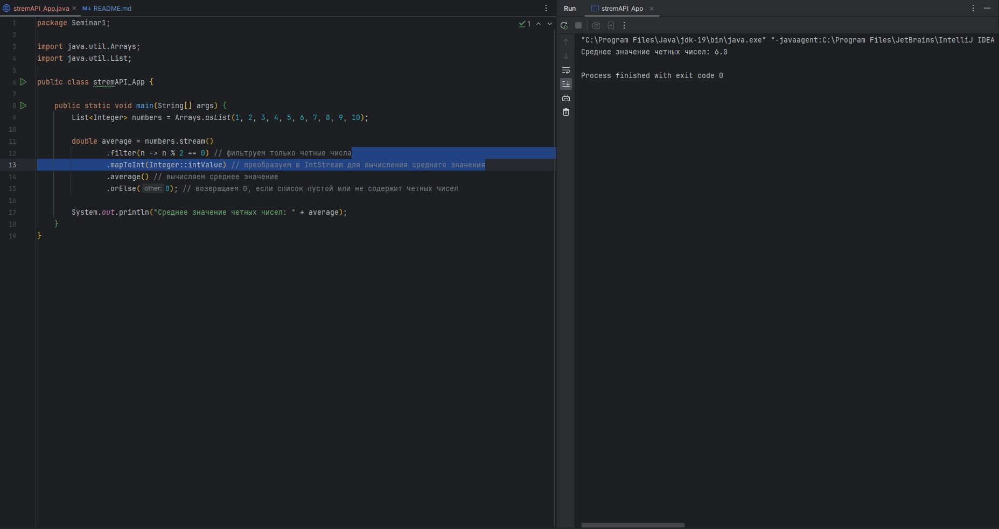
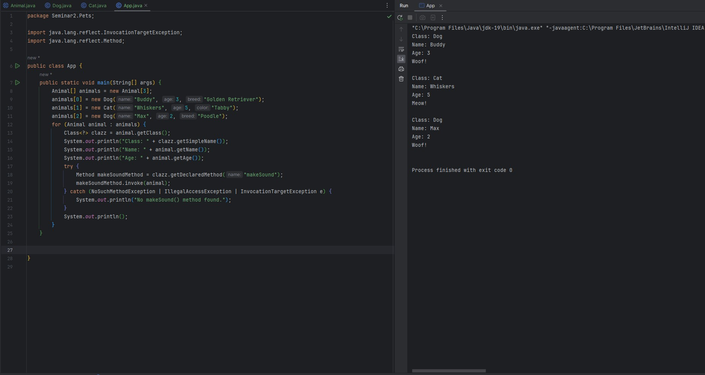
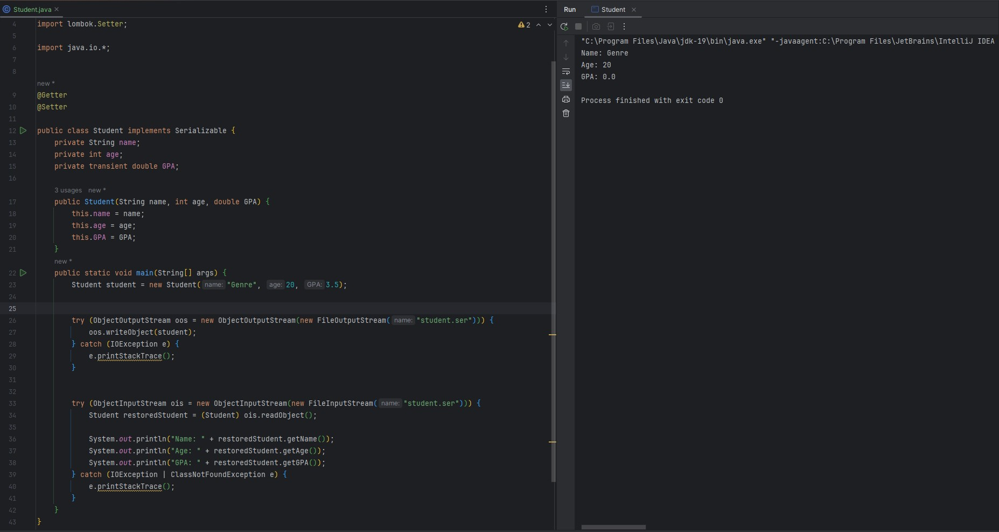
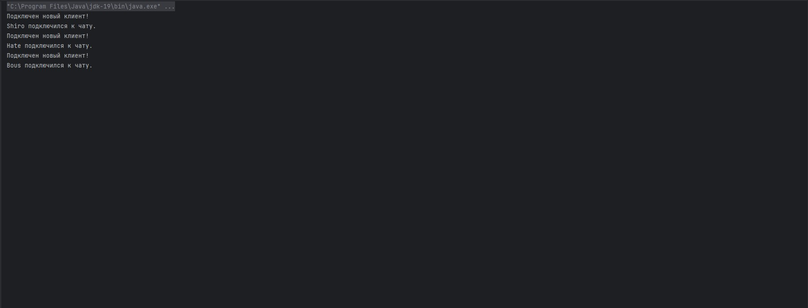
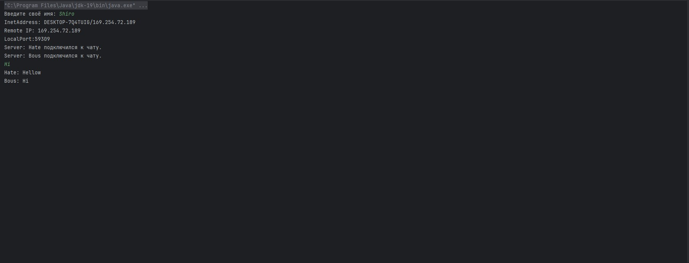

# Java Junior (семинары)

Урок 1. Лямбды и Stream API

        Напишите программу, которая использует Stream API для обработки списка чисел. 
        Программа должна вывести на экран среднее значение всех четных чисел в списке.

Урок 2. Reflection API

        Создайте абстрактный класс "Animal" с полями "name" и "age".
        Реализуйте два класса-наследника от "Animal" (например, "Dog" и "Cat") с уникальными полями и методами.
        Создайте массив объектов типа "Animal" и с использованием Reflection API выполните следующие действия:
        Выведите на экран информацию о каждом объекте.
        Вызовите метод "makeSound()" у каждого объекта, если такой метод присутствует.

Урок 3. Сериализация

        Разработайте класс Student с полями String name, int age, transient double GPA (средний балл).
        Обеспечьте поддержку сериализации для этого класса.
        Создайте объект класса Student и инициализируйте его данными.
        Сериализуйте этот объект в файл.
        Десериализуйте объект обратно в программу из файла.
        Выведите все поля объекта, включая GPA, и ответьте на вопрос,
        почему значение GPA не было сохранено/восстановлено.

        Ответ: Значение поля GPA не было сохранено/восстановлено потому, что оно было помечено ключевым словом `transient`. 
        Трансиентные поля не участвуют в процессе сериализации и десериализации объекта.

Урок 4. Базы данных и инструменты взаимодействия с ними

        Создайте базу данных (например, SchoolDB).
        В этой базе данных создайте таблицу Courses с полями id (ключ), title, и duration.
        Настройте Hibernate для работы с вашей базой данных.
        Создайте Java-класс Course, соответствующий таблице Courses, с необходимыми аннотациями Hibernate.
        Используя Hibernate, напишите код для вставки, чтения, обновления и удаления данных в таблице Courses.
        Убедитесь, что каждая операция выполняется в отдельной транзакции.

Урок 5. Клиент/Сервер своими руками

        Разработайте простой чат на основе сокетов как это было показано на самом семинаре. 
        Ваше приложение должно включать в себя сервер, который принимает сообщения от клиентов и пересылает их всем участникам чата.
        (Вы можете просто переписать наше приложение с семинара, этого будет вполне достаточно)

